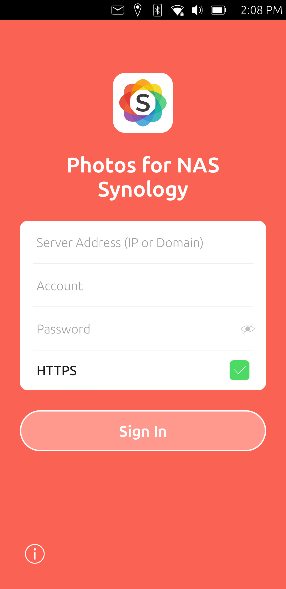
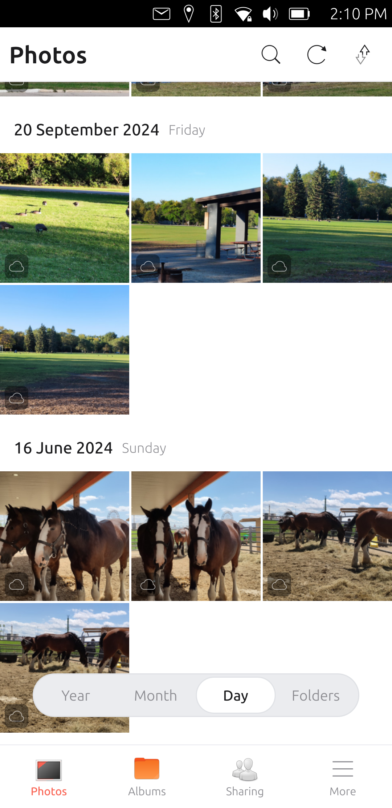
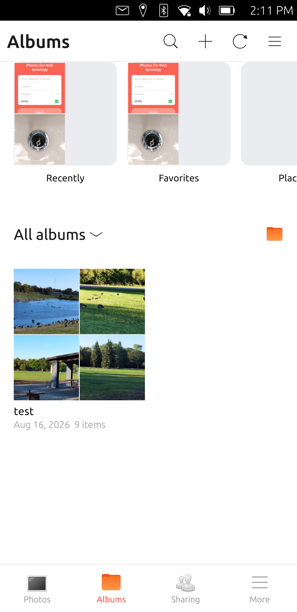
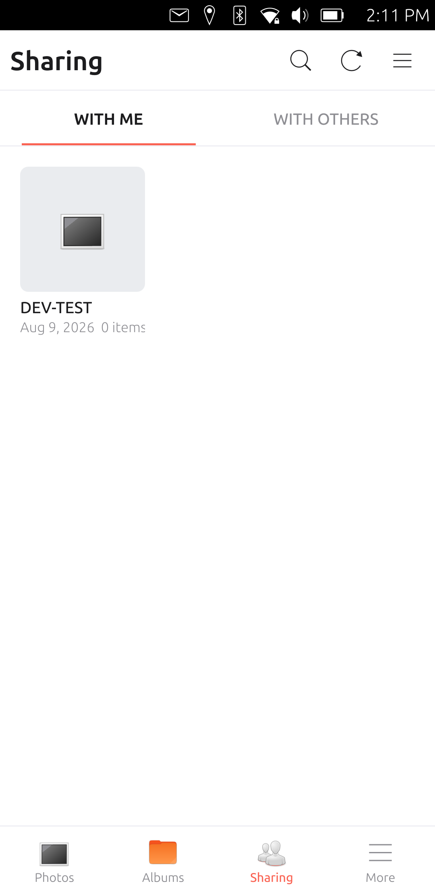
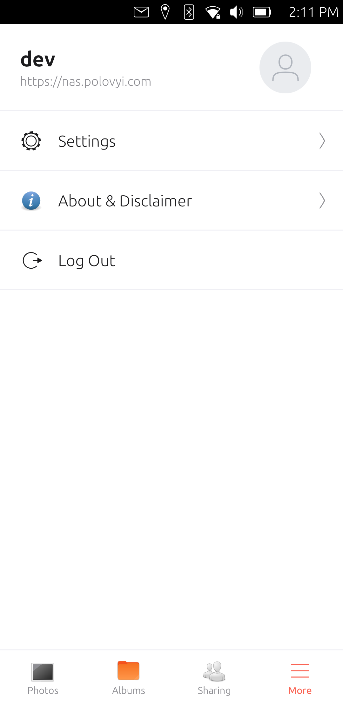
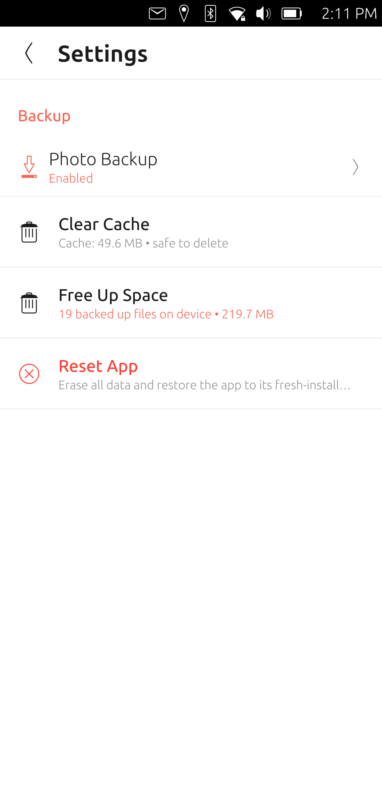

# Photos for NAS Synology

An unofficial, native Ubuntu Touch (Lomiri) application to browse, manage,
back up and share your photos and videos from a Synology NAS using the
Synology Photos API.

[](LICENSE)
[](https://ubuntu-touch.io/)
[](https://clickable-ut.dev/)
[](https://www.paypal.com/donate/?hosted_button_id=2XZA9R384M7R6)

> **Disclaimer:** This application has no affiliation or connection with
> Synology Inc. "Synology" and "Synology Photos" are registered trademarks of
> Synology Inc. This software is provided "as is" without any warranties, is
> used at your own risk, and we accept no responsibility or liability.

## Features

- **Photo Timeline & Gallery** — browse personal and shared photos
  chronologically, with folders and favorites
- **Album Management** — explore normal and shared albums, create albums,
  add and remove photos, delete albums
- **High-Resolution Viewer** — fullscreen viewer with pinch-to-zoom, pan,
  swipe navigation and metadata inspector
- **Video Streaming** — stream mobile-optimized transcoded H.264 video
- **Backup & Upload** — back up photos and videos from your device straight
  to your NAS (Personal Space), track upload progress and manage local files
- **Search & Sharing** — full-text search, share links with passphrase,
  expiration and permission control
- **Direct Connection** — the app talks only to your NAS; no intermediate
  servers, your data stays between your device and your NAS
- **Session Handling** — automatic re-login prompt when the session expires
- **Privacy** — passwords are never stored on the device
- **Convergence Ready** — adapts from phones to tablets and desktop displays

## Screenshots

<p align="center">
  
  
  
</p>
<p align="center">
  
  
  
</p>

## How it's built

The app is an unofficial, community-made client for Synology's **Synology
Photos**, rebuilt natively for Ubuntu Touch. The UI/UX and the Synology
Photos Web API were recreated to preserve the original look and feel.

### AI Development Process

This project is a unique showcase of modern software engineering utilizing
Artificial Intelligence as a core development driver:

- **AI-Driven Engineering** — the application was built heavily through the
  use of AI tools and models to generate QML UI components, Qt bindings, and
  API logic.
- **Visual Modeling & Prompting** — the interface and business logic were
  recreated purely by visually observing the official Synology Photos
  application and precisely describing those behaviors and visual aspects via
  text prompts to the AI.
- **No Reverse Engineering** — we did not use decompilation, code scanning,
  cracking, or any other reverse-engineering techniques against the official
  Synology application.
- **Public Open Sources** — all Synology API endpoints (`SYNO.Foto.*`,
  `SYNO.API.Auth`) utilized in this project were discovered through public
  internet forums, documentation, and standard diagnostic tools (e.g., browser
  developer tools, curl) used against our own NAS devices.
- **Human Review & Testing** — the AI-generated code underwent strict code
  reviews and was rigorously tested by live human developers on physical
  devices — specifically the Google Pixel 3a and Google Pixel 3a XL running
  the latest version of Ubuntu Touch (Focal).

**Tech stack:**

- **Qt 5.12 / QtQuick 2.9** with the **Ubuntu UI Toolkit** (`Ubuntu.Components 1.3`)
- **QtMultimedia** for video playback
- **QtQuick.LocalStorage** (SQLite) for local settings, credentials and caches
- **C++ / Qt (QtNetwork)** for the backup engine, uploads, media proxy and
  image provider
- **CMake + Clickable** build system, AppArmor-confined click package

**Architecture:**

- `qml/Main.qml` — entry point: session state, global dialogs/overlays,
  error handling
- `qml/pages/` — screens: login, photo timeline, albums, album detail, photo
  viewer, search, sharing, backup settings/folders, uploads, more, about
- `qml/components/` — reusable UI: custom header and bottom navigation
  (matching the original app), photo grid, timeline, dialogs, sheets, toasts
- `qml/js/SynologyApi.js` — REST client for the Synology DSM Web API
  (`SYNO.API.Auth`, `SYNO.Foto.*`): login, timelines, albums,
  folders, favorites, search, sharing, thumbnails, streaming
- `qml/js/Storage.js` — SQLite wrapper for credentials, settings and cache
- `src/` — C++ bridge: `BackupEngine` (media scan, upload, local playback
  cache, media proxy) and `SynoImageProvider` (in-grid image loading)

## Build and Run

```bash
# requires clickable (https://clickable-ut.dev)
git clone https://github.com/puqcloud/Photos-for-NAS-Synology
cd Photos-for-NAS-Synology
clickable
```

Multi-architecture release packages:

```bash
clickable build --arch arm64 --arch armhf
```

To run directly via qmlscene (if dependencies are met):

```bash
qmlscene qml/Main.qml
```

## Security & Privacy

1. **No Third-Party Relays:** All network requests travel directly between
   your Ubuntu Touch device and your Synology NAS server. No intermediate
   proxy or tracking servers are used.
2. **Local Storage:** Credentials, session identifiers (SID), and tokens are
   kept in the app's isolated local storage (`LocalStorage` SQLite) on the
   device.
3. **AppArmor Confinement:** The application strictly conforms to Ubuntu
   Touch's AppArmor sandbox, confining permissions to network access, media
   playback and the media folders used by the backup feature.

## Contributing

Contributions, bug reports, and suggestions are welcome! Please check
[CONTRIBUTING.md](CONTRIBUTING.md) for details on our workflow and guidelines.

## Author & Support

- **PUQ Software** — Ruslan Polovyi
- Email: [ruslan@polovyi.com](mailto:ruslan@polovyi.com)
- Website: [https://polovyi.com/](https://polovyi.com/)
- Donate: [Support via PayPal](https://www.paypal.com/donate/?hosted_button_id=2XZA9R384M7R6)

## License

[MIT](LICENSE) © 2026 PUQ Software (Ruslan Polovyi)
